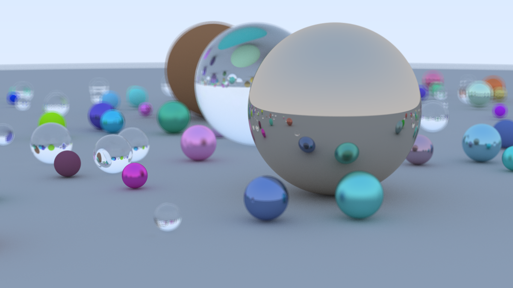

# rs-ray-tracer

A ray tracer written in rust based on the awesome book 'Ray Tracing in One Weekend'.



## Run

```
cargo run --release > image.ppm
xdg-open image.ppm
```

## Documentation

https://raytracing.github.io/books/RayTracingInOneWeekend.html

